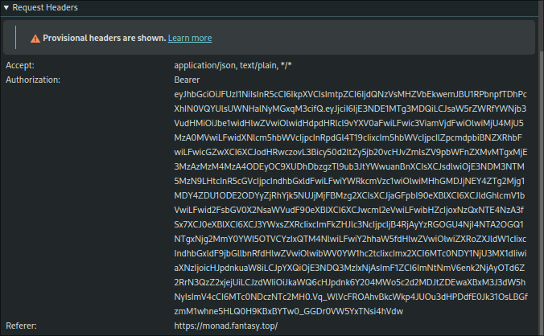
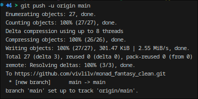
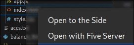

🃏 Fantasy Top Viewer
This tool lets you view and filter Fantasy Top cards tied to different accounts.

🚀 How to Use
1. Update Your Privy ID Token
Open the config.py file and update the following field:

python
Copy
Edit
privy_id_token = "your_token_here"
⚠️ This token expires every ~15 minutes, so make sure to refresh it regularly.

🔍 How to Find Your Privy Token:
Open the Fantasy Top website.

Right-click and choose Inspect or press Ctrl+Shift+I / F12.

In the Network tab, search for requests containing your wallet address.

Click one of them and look for the Authorization header.

Copy the token as shown below:

2. Save the Config
Save your changes to config.py.

3. Run the Script
Navigate to the folder containing main.py and run:

bash
Copy
Edit
python main.py
4. Open the Card Viewer in Browser
Make sure you have Five Server installed in VS Code.

Go to the cards_viewer/ folder.

Right-click on index.html and choose "Open with Five Server".

5. Interact With the Cards
Use the filters in the viewer to explore different cards.

Click on a card to see which accounts hold it.